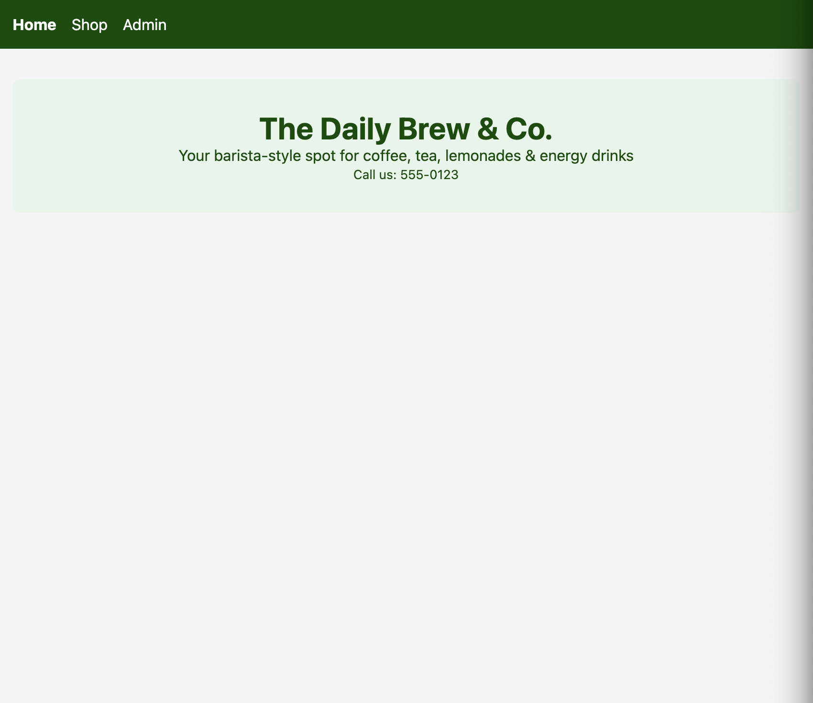
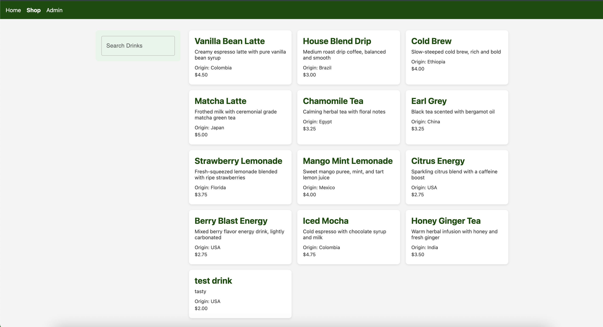
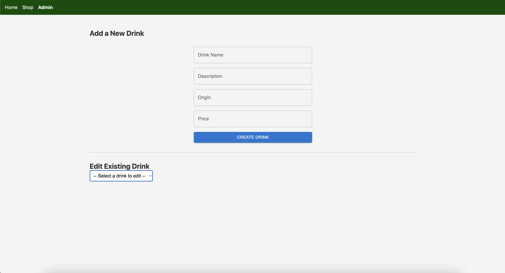

# 🍹 Drink Barista App

## Description

A single-page application for “The Daily Brew & Co.” barista-style drink shop.

**Features:**

- Home page with store information
- Shop page with searchable, responsive grid of drinks
- Admin portal for creating, editing & deleting drink entries

## Component Architecture

```text
src/
├── api/
│     └── drinks.js            # fetch/post/patch wrappers using native fetch
├── components/
│     ├── NavBar/
│     │     └── NavBar.jsx     # navigation links
│     ├── StoreBanner/
│     │     ├── StoreBanner.jsx  # home page header, fetches store_info
│     │     └── StoreBanner.module.css
│     ├── ShopPage/
│     │     ├── ShopPage.jsx     # fetches drinks, handles search
│     │     └── ShopPage.module.css
│     ├── FilterSidebar/
│     │     ├── FilterSidebar.jsx# search input component
│     │     └── FilterSidebar.module.css
│     ├── ProductGrid/
│     │     ├── ProductGrid.jsx  # grid layout
│     │     └── ProductGrid.module.css
│     ├── ProductCard/
│     │     ├── ProductCard.jsx  # individual drink card
│     │     └── ProductCard.module.css
│     ├── AdminPortal/
│     │     ├── AdminPortal.jsx  # renders create & edit forms
│     │     └── AdminPortal.module.css
│     ├── ProductForm/
│     │     ├── ProductForm.jsx   # create-drink form
│     │     └── ProductForm.module.css
│     ├── EditDrinkForm/
│     │     ├── EditDrinkForm.jsx # edit-drink form
│     │     └── EditDrinkForm.module.css
│     ├── TextInput/
│     └── SubmitButton/
└── hooks/
      ├── useFetch.js           # custom fetch hook (data, loading, error)
      └── useFormFields.js      # form-state management hook
```

## Tech Stack

- **Build & Bundler:** Vite
- **Frontend:** React, React Router
- **Styling:** CSS Modules, Material-UI (MUI)
- **Mock API:** json-server
- **Testing:** Vitest, React Testing Library

## Getting Started

1. **Clone the repo**

   ```bash
   git clone <repo-url>
   cd drink-barista-app
   ```

2. **Install dependencies**

   ```bash
   npm install
   ```

3. **Run the mock API server**

   ```bash
   npm run server
   # serves db.json at http://localhost:4000
   ```

4. **Run the development server**

   ```bash
   npm run dev
   # open http://localhost:5173
   ```

5. **Execute all tests**
   ```bash
   npm test
   ```

## CRUD Functionality & Testing

### 1. Read (GET)

- **API:**
  - `fetchDrinks()` and `fetchStoreInfo()` in `src/api/drinks.js`
  - All GET logic is wrapped by the `useFetch` hook.
- **UI:**
  - **Home:** `StoreBanner` loads `store_info/1` and displays name, description, phone.
  - **Shop:** `ShopPage` loads `/drinks`, renders `ProductGrid` and `FilterSidebar`.
- **Tests:**
  - **`useFetch` tests** stub `global.fetch` to simulate 200 and error responses, verify loading → success → error flows.
  - **`ShopPage` test** mocks `useFetch` to return an array of drinks, renders the grid, types into the search box, and asserts that the list filters correctly.
- **Challenges & Solutions:**
  1. **Hanging real fetch:** default `fetch()` never resolves in JSDOM → stub `global.fetch` in tests.
  2. **Hook-mock ordering:** if `useFetch` is imported before the mock is applied, the real fetch runs → hoist `vi.mock('../hooks/useFetch')` to top of test files.

---

### 2. Create (POST)

- **API:**
  - `createDrink(drink)` posts to `/drinks` with JSON body.
- **UI:**
  - `ProductForm` controlled form with `useFormFields` hook; validates inputs, shows error/success messages.
- **Tests:**
  - **`ProductForm` tests** spy on `createDrink`, render the form, leave fields empty to trigger validation errors, fill in valid data, click submit, and assert that `createDrink` was called with the correct object and that the success message appears.
- **Challenges & Solutions:**
  1. **Module exports immutable:** assigning `api.createDrink = vi.fn()` throws “only a getter” → use `vi.spyOn(api, 'createDrink')`.
  2. **Asynchronous form state:** using `getByText` immediately sometimes races → use `findByText` or wrap assertions in `waitFor()`.

---

### 3. Update (PATCH)

- **API:**
  - `updateDrink(id, updates)` issues `PATCH /drinks/:id`.
- **UI:**
  - `EditDrinkForm` fetches a single drink, populates fields, validates edits, and calls `updateDrink` on submit.
- **Tests:**
  - **`EditDrinkForm` tests** stub the GET fetch, spy on `api.updateDrink`, render the form, change a field, click “Update Drink,” and assert that `updateDrink` was called with the right arguments and that the success message and `onUpdated` callback fire.
- **Challenges & Solutions:**
  1. **Hook import timing:** mocked hook must be in place before component import → use top-of-file `vi.mock('../hooks/useFetch')` or `vi.spyOn(fetchHook, 'default')`.
  2. **Input value assertion:** asserting too early fails → use `findByDisplayValue` or `waitFor()`.

---

### 4. Delete (DELETE)

- **API:**
  - `deleteDrink(id)` issues `DELETE /drinks/:id`.
- **UI:**
  - In `EditDrinkForm`, a “Delete Drink” button calls `deleteDrink`, displays a deletion success message, and triggers the `onUpdated` callback to refresh the list.
- **Tests:**
  - **`EditDrinkForm` delete test** stubs the GET fetch, spies on `api.deleteDrink`, clicks the “Delete Drink” button, and asserts `deleteDrink` was called with the correct ID, the callback fired, and the “Drink deleted successfully!” message appears.
- **Challenges & Solutions:**
  1. **Ensuring spy on deleteDrink:** use `vi.spyOn(api, 'deleteDrink')` in `beforeEach` so the function is a spy.
  2. **Waiting for callback:** wrap `expect(api.deleteDrink).toHaveBeenCalledWith(...)` in `await waitFor()` to catch the async call.

## Screenshots

### Home Page



### Shop Page



### Admin Portal


